# SDG Hub KFP Component Architecture Design

## Document Information

| Field | Value |
|-------|-------|
| **Status** | Draft |
| **Authors** | SDG Hub Team |
| **Created** | 2025-01-16 |
| **Last Updated** | 2025-01-16 |

---

## Table of Contents

1. [Overview](#1-overview)
2. [Background & Motivation](#2-background--motivation)
3. [Component Scope & Granularity](#3-component-scope--granularity)
4. [Input Data Interface](#4-input-data-interface)
5. [Output Data Interface](#5-output-data-interface)
6. [Flow Selection & Configuration](#6-flow-selection--configuration)
7. [Model/LLM Configuration](#7-modelllm-configuration)
8. [Execution Configuration](#8-execution-configuration)
9. [Error Handling & Observability](#9-error-handling--observability)
10. [Container & Packaging](#10-container--packaging)

---

## 1. Overview

### 1.1 What We Are Building

A **Kubeflow Pipelines (KFP) component** that wraps the SDG Hub SDK to enable synthetic data generation within Kubernetes-native ML pipelines. This component allows users to:

- Run SDG Hub flows (built-in or custom) as pipeline steps
- Generate synthetic training data at production scale
- Integrate seamlessly with upstream data preparation and downstream model training components

### 1.2 Component at a Glance

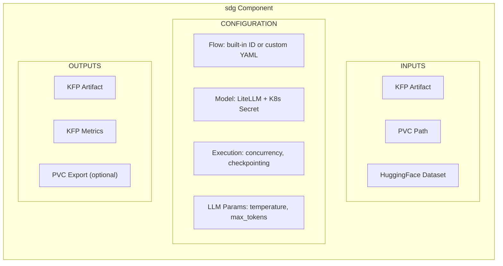

### 1.3 Design Principles

| Principle | Description |
|-----------|-------------|
| **Kubernetes Native** | Use K8s primitives: Secrets for credentials, PVCs for storage, ConfigMaps for configuration |
| **KFP Native** | Use KFP Artifacts for data passing, Metrics for observability, native pipeline composition |
| **Production Scale** | Designed for large datasets with checkpointing, concurrency control, and resumability |
| **Flexible I/O** | Support multiple input sources and output destinations for e2e pipeline integration |
| **Minimal Surface** | Expose only what's needed for production use; no experimentation/discovery features |

---

## 2. Background & Motivation

### 2.1 What is SDG Hub?

SDG Hub is a Python framework for synthetic data generation using composable blocks and flows:

- **Blocks** are atomic data transformation units (LLM chat, text parsing, filtering)
- **Flows** orchestrate multiple blocks into YAML-defined pipelines
- **Data flows** through blocks sequentially: `dataset -> Block1 -> Block2 -> ... -> enriched_dataset`

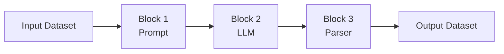

### 2.2 Why a KFP Component?

**Problem:** Organizations need to generate synthetic training data as part of their ML pipelines, but:

1. Running SDG manually doesn't integrate with existing pipeline infrastructure
2. Scaling requires Kubernetes orchestration
3. Credential management needs enterprise-grade security
4. Long-running jobs need checkpointing and observability

**Solution:** A KFP component that provides:

| Capability | Benefit |
|------------|---------|
| **Pipeline Integration** | Chain with data prep, training, and evaluation steps |
| **K8s Orchestration** | Automatic scheduling, resource management, scaling |
| **Secret Management** | Secure credential handling via K8s Secrets |
| **Checkpointing** | Resume interrupted jobs, survive pod restarts |
| **Observability** | Native KFP metrics, logging, artifact tracking |

### 2.3 Target Use Cases

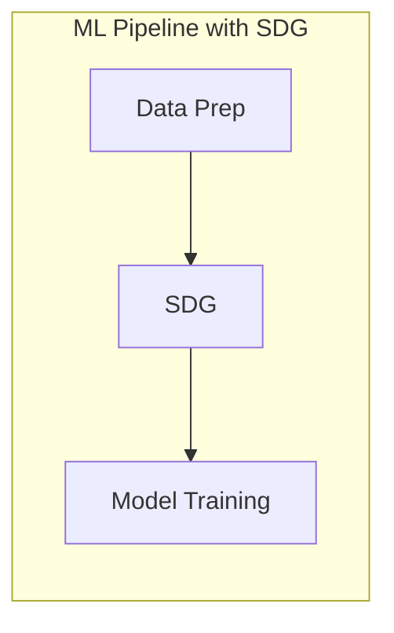

Examples:
- **Knowledge tuning**: document -> QA pairs -> fine-tune LLM
- **Instruction tuning**: seed data -> diverse examples -> train
- **Data augmentation**: small dataset -> expanded dataset -> train

### 2.4 Non-Goals

The following are explicitly **out of scope** for this component:

- Flow/block discovery and exploration (use SDK directly)
- Interactive experimentation (use notebooks)
- Flow development and debugging (use SDK's dry_run locally)
- Multi-flow orchestration (use multiple component instances)

---

## 3. Component Scope & Granularity

### 3.1 Decision Summary

| Aspect | Decision |
|--------|----------|
| **Architecture** | Single monolithic component |
| **Flow Selection** | Support both built-in flows and custom YAML |
| **Scope** | Production execution only |

### 3.2 Selected: Single Monolithic Component

One component handles everything: flow selection, model config, execution.

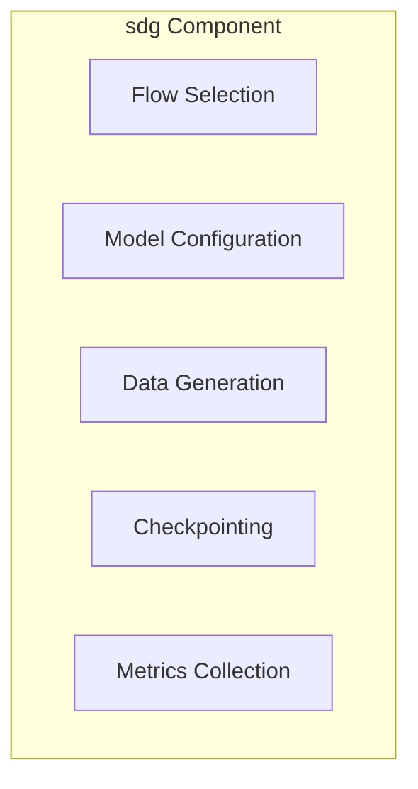

**Why Selected:**
- Simple to use - one component does it all
- Fewer artifacts passed between components
- Matches production pattern: "run this flow on this data"
- Validation is built into `flow.generate()`

### 3.3 Rejected Options

| Option | Why Rejected |
|--------|--------------|
| **Multi-Component** (separate validate, generate, postprocess) | Adds complexity; validation already built into generate() |
| **Core + Utilities** (main component + discovery tools) | Utilities rarely used in production; extra maintenance |

---

## 4. Input Data Interface

### 4.1 Decision Summary

| Aspect | Decision |
|--------|----------|
| **Primary Interface** | KFP Artifact (native tracking & composition) |
| **Alternative Inputs** | Import from PVC, Import from HuggingFace |
| **File Format** | JSONL only |
| **Checkpoint Resume** | Via checkpoint PVC path |

### 4.2 Input Architecture

The component uses **KFP Artifacts as the primary interface** for pipeline composition and tracking. PVC and HuggingFace are "import" options that get converted to artifacts internally.

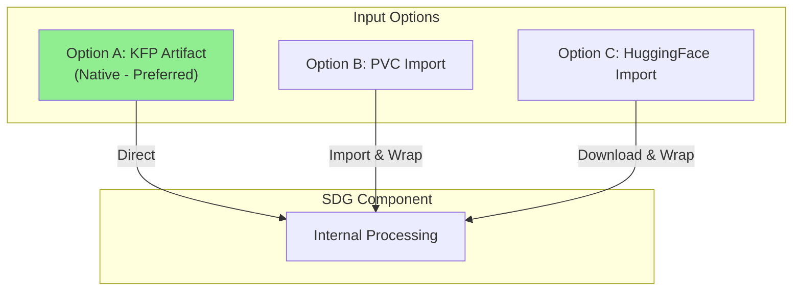

**Priority:** Artifact > PVC Path > HuggingFace

### 4.3 Input Flow Details

#### Option A: KFP Artifact (Native - Preferred)

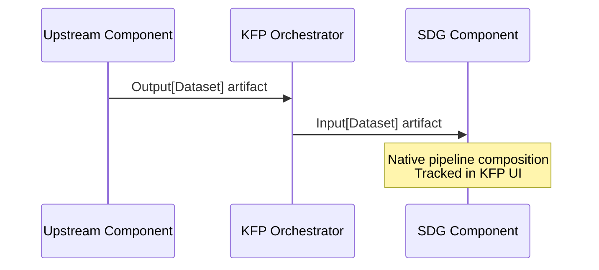

#### Option B: PVC Import

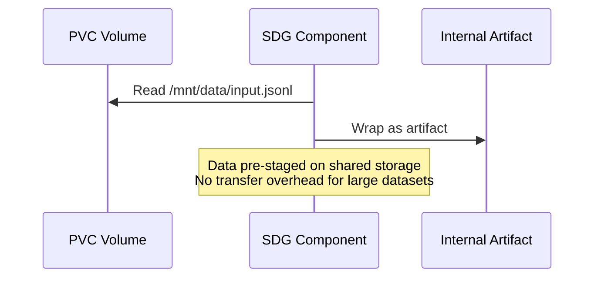

#### Option C: HuggingFace Import

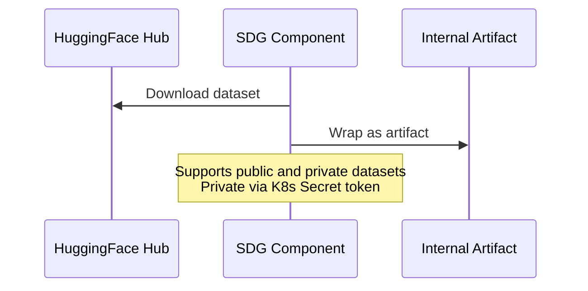

### 4.4 Why This Design?

| Alternative | Why Rejected |
|-------------|--------------|
| **KFP Artifacts Only** | Doesn't support pre-staged data; transfer overhead for large datasets |
| **Volume Paths Only** | Loses KFP native tracking; harder pipeline composition |

**Selected: Hybrid with Import/Export** because it provides KFP native tracking while supporting external data sources.

### 4.5 File Format Decision

| Format | Decision | Rationale |
|--------|----------|-----------|
| **JSONL** | Supported | Human-readable, matches SDK checkpoint format, simple |
| **Parquet/CSV** | Not supported | Adds complexity; JSONL sufficient for production |

### 4.6 HuggingFace Dataset Configuration

```yaml
hf_dataset_config:
  dataset_name: "squad"              # Required: dataset identifier
  config: "v2.0"                     # Optional: dataset configuration
  split: "train"                     # Optional: dataset split (default: "train")
  token_secret_name: "hf-token"      # Optional: K8s Secret for private datasets
```

### 4.7 Checkpoint Resume

The component supports resuming interrupted jobs via checkpoints stored on PVC.

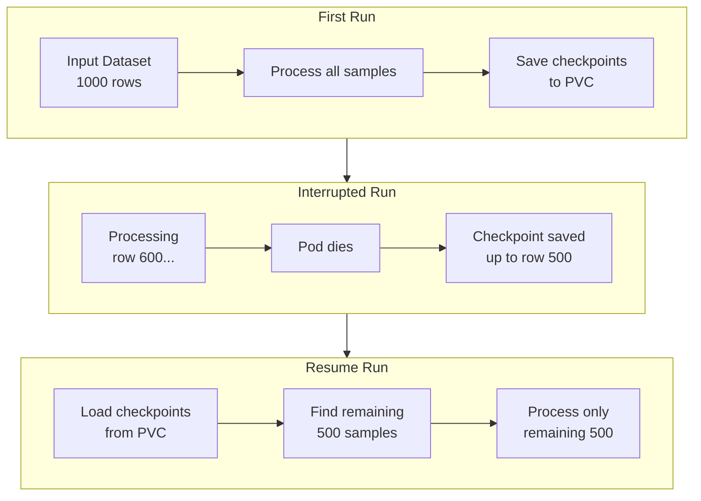

**How It Works:**

1. On start: Check `checkpoint_pvc_path` for existing checkpoints
2. If found: Load completed samples, identify remaining work
3. Processing: Only process samples not yet completed
4. Periodic saves: Save checkpoints every `save_freq` samples
5. Final merge: Combine checkpoint data with newly processed data

**Why PVC for Checkpoints:** PVC persists across pod restarts; KFP temp paths and EmptyDir do not.

### 4.8 Component Interface (Input Parameters)

```python
@component
def sdg(
    # ==================== INPUT OPTIONS ====================
    # Option A: KFP Artifact (native, preferred)
    input_artifact: Input[Dataset] = None,

    # Option B: Import from PVC
    input_pvc_path: str = None,  # e.g., "/mnt/data/input.jsonl"

    # Option C: Import from HuggingFace
    hf_dataset_config: dict = None,
    # {
    #     "dataset_name": "squad",
    #     "config": "v2.0",
    #     "split": "train",
    #     "token_secret_name": "hf-creds"
    # }

    # ==================== CHECKPOINT RESUME ====================
    checkpoint_pvc_path: str = None,  # e.g., "/mnt/checkpoints/"
    # ...
):
```

### 4.9 Usage Examples

#### Example 1: Input from Upstream Component

```python
@dsl.pipeline
def training_pipeline():
    prep_task = data_preparation(raw_data_path="/data/raw")

    sdg_task = sdg(
        input_artifact=prep_task.outputs["output_dataset"],
        flow_id="extractive-summary-qa",
    )

    train_task = train_model(
        training_data=sdg_task.outputs["output_artifact"],
    )
```

#### Example 2: Input from PVC

```python
sdg_task = sdg(
    input_pvc_path="/mnt/shared-data/seed_documents.jsonl",
    flow_id="extractive-summary-qa",
)
```

#### Example 3: Resume from Checkpoint

```python
sdg_task = sdg(
    input_pvc_path="/mnt/data/large_dataset.jsonl",
    checkpoint_pvc_path="/mnt/checkpoints/job-123/",
    save_freq=100,
    flow_id="extractive-summary-qa",
)
# If pod restarts, checkpoints are automatically loaded and resumed
```

---

## 5. Output Data Interface

### 5.1 Decision Summary

| Aspect | Decision |
|--------|----------|
| **Primary Output** | KFP Artifact (always produced) |
| **Optional Export** | Export to PVC |
| **Output Structure** | Nested: `{path}/{flow_id}/{timestamp}/generated.jsonl` |
| **Metrics** | KFP Metrics artifact (native) |

### 5.2 Output Architecture

The component **always produces a KFP Artifact** for native pipeline composition. Users can **optionally export** to PVC for external access.

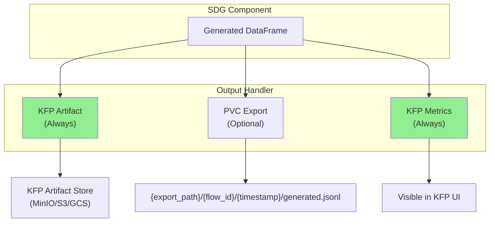

### 5.3 Why Always Produce KFP Artifact?

| Benefit | Description |
|---------|-------------|
| **Pipeline Composition** | Enables `sdg_task.outputs["output_artifact"]` for downstream steps |
| **Tracking** | Visible in KFP UI; linked to pipeline run |
| **Lineage** | KFP tracks artifact provenance automatically |
| **Consistency** | Same interface regardless of input source |

### 5.4 Optional PVC Export

When `export_to_pvc=True`, output is **also** written to PVC:

```
{export_path}/{flow_id}/{timestamp}/generated.jsonl

Example:
/mnt/output/extractive-summary-qa/20250116_143052/generated.jsonl
```

**Nested structure rationale:**
- `flow_id`: Identifies which flow produced the output
- `timestamp`: Supports multiple runs without overwriting

### 5.5 KFP Metrics

The component produces metrics visible in KFP UI:

```python
metrics.log_metric("total_input_rows", 1000)
metrics.log_metric("total_output_rows", 850)
metrics.log_metric("execution_time_seconds", 3456.7)
metrics.log_metric("successful_blocks", 8)
metrics.log_metric("failed_blocks", 0)
```

### 5.6 Component Interface (Output Parameters)

```python
@component
def sdg(
    # ... input parameters ...

    # ==================== OUTPUT ====================
    output_artifact: Output[Dataset],
    output_metrics: Output[Metrics],
    export_to_pvc: bool = False,
    export_path: str = None,  # e.g., "/mnt/output/"
):
```

### 5.7 Usage Examples

#### Example 1: Output to Downstream Component Only

```python
@dsl.pipeline
def training_pipeline():
    sdg_task = sdg(
        input_artifact=prep_task.outputs["dataset"],
        flow_id="qa-generation",
    )

    train_task = train_model(
        training_data=sdg_task.outputs["output_artifact"],
    )
```

#### Example 2: Output to Both Artifact and PVC

```python
sdg_task = sdg(
    input_pvc_path="/mnt/data/input.jsonl",
    flow_id="qa-generation",
    export_to_pvc=True,
    export_path="/mnt/output/",
)
# Output at: /mnt/output/qa-generation/20250116_143052/generated.jsonl
# Artifact still available for pipeline composition
```

---

## 6. Flow Selection & Configuration

### 6.1 Decision Summary

| Aspect | Decision |
|--------|----------|
| **Flow Selection** | Built-in flow ID or custom YAML path |
| **Custom Flow Source** | Path-based (YAML mounted from ConfigMap) |
| **Runtime Params Structure** | Flat dict (matches SDK) |
| **Component-Level LLM Params** | Mirror SDK block-level params |
| **Override Priority** | Flow YAML → Component-level → Block-level |
| **Flow Validation** | No pre-validation; rely on generate() fail-fast |

### 6.2 Flow Selection Modes

The component supports two mutually exclusive modes for specifying which flow to run:

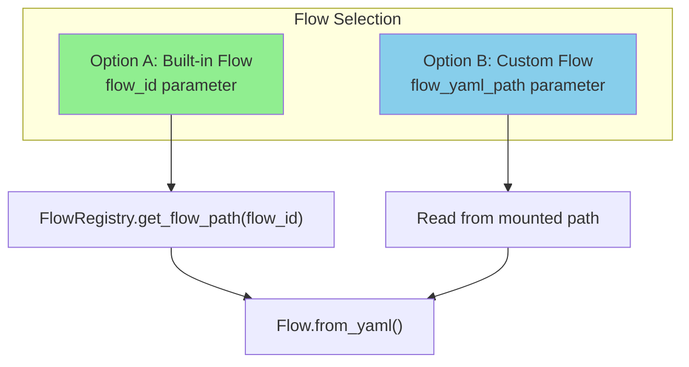

| Mode | Parameter | Use Case |
|------|-----------|----------|
| **Built-in Flow** | `flow_id` | Use pre-packaged flows from SDG Hub registry |
| **Custom Flow** | `flow_yaml_path` | Use custom flow YAML mounted from ConfigMap |

**Priority:** If both provided, `flow_yaml_path` takes precedence.

### 6.3 Custom Flow YAML from ConfigMap

Custom flow YAML files are mounted into the container from Kubernetes ConfigMaps. This follows K8s-native configuration patterns.

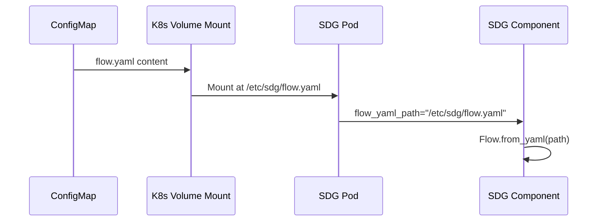

**Why ConfigMap over other options:**

| Alternative | Why Not Selected |
|-------------|------------------|
| **Inline YAML as string param** | Unwieldy for complex flows; hard to manage |
| **KFP Artifact** | Flows are config, not data; ConfigMap is more appropriate |
| **PVC only** | ConfigMap is more K8s-native for configuration |

**Note:** PVC paths also work since the component just reads from a file path. ConfigMap is the recommended approach for K8s-native configuration management.

#### ConfigMap Example

```yaml
# K8s ConfigMap definition
apiVersion: v1
kind: ConfigMap
metadata:
  name: custom-qa-flow
  namespace: ml-pipelines
data:
  flow.yaml: |
    metadata:
      name: "Custom QA Generation Flow"
      version: "1.0.0"
      description: "Organization-specific QA generation"

    blocks:
      - block_type: PromptBuilderBlock
        block_config:
          block_name: build_prompt
          input_cols: ["document"]
          output_cols: ["messages"]
          prompt_config_path: prompt.yaml

      - block_type: LLMChatBlock
        block_config:
          block_name: generate_qa
          input_cols: ["messages"]
          output_cols: ["response"]
          max_tokens: 2048
```

#### Pipeline Usage with ConfigMap

```python
from kfp import dsl
from kfp import kubernetes

@dsl.pipeline
def training_pipeline():
    sdg_task = sdg(
        input_pvc_path="/mnt/data/input.jsonl",
        flow_yaml_path="/etc/sdg/flow.yaml",  # Mounted from ConfigMap
        model="hosted_vllm/meta-llama/Llama-3.3-70B-Instruct",
    )

    # Mount ConfigMap as volume
    kubernetes.use_config_map_as_volume(
        sdg_task,
        config_map_name="custom-qa-flow",
        mount_path="/etc/sdg",
    )
```

### 6.4 Parameter Override System

The component implements a three-tier parameter override system that mirrors the SDK's behavior while adding a component-level tier for convenience.

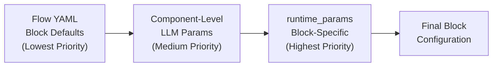

**Override Priority (lowest to highest):**

1. **Flow YAML Defaults**: Parameters defined in the flow's block configurations
2. **Component-Level Params**: Global LLM parameters passed to the component
3. **Block-Level Overrides**: Per-block settings in `runtime_params` dict

### 6.5 Component-Level LLM Parameters

The component exposes common LLM parameters at the component level for convenience. These are applied globally to all LLM blocks, then can be overridden per-block via `runtime_params`.

**Parameters (mirroring SDK's LLMChatBlock):**

| Parameter | Type | Description |
|-----------|------|-------------|
| `temperature` | float | Generation randomness (0.0-2.0) |
| `max_tokens` | int | Maximum response length |
| `top_p` | float | Nucleus sampling threshold (0.0-1.0) |
| `n` | int | Number of completions per input |
| `presence_penalty` | float | Penalize new topics (-2.0 to 2.0) |
| `frequency_penalty` | float | Penalize repetition (-2.0 to 2.0) |

**Why expose at component level:**

- **Convenience**: Common parameters don't require `runtime_params` dict
- **Discoverability**: Visible in component interface documentation
- **SDK Consistency**: Matches parameters available on SDK blocks

### 6.6 Runtime Parameters (Block-Level Overrides)

The `runtime_params` parameter accepts a flat dict matching the SDK's interface. Keys are block names, values are parameter dicts.

```python
runtime_params = {
    # Block-specific overrides (keyed by block_name)
    "gen_detailed_summary": {
        "n": 50,
        "max_tokens": 4096,
        "temperature": 0.5,
    },
    "question_generation": {
        "temperature": 0.9,
        "max_tokens": 256,
    },
    "quality_filter": {
        "filter_value": 0.85,
    },
}
```

**Why flat dict over structured list:**

| Alternative | Why Not Selected |
|-------------|------------------|
| **Structured list** `[{block_name: ..., params: {...}}]` | More verbose; doesn't match SDK interface |

**Selected: Flat dict** for SDK consistency and simplicity.

### 6.7 Flow Validation

The component does **not** perform pre-validation (dry_run) before execution.

**Rationale:**

- `flow.generate()` already validates inputs and fails fast with clear errors
- Pre-validation adds latency without benefit in production
- Flows used in production are pre-tested during development
- Clear error messages from `generate()` are sufficient for debugging

### 6.8 Component Interface (Flow & Params)

```python
@component
def sdg(
    # ... input/output params ...

    # ==================== FLOW SELECTION ====================
    flow_id: str = None,           # Built-in flow from registry
    flow_yaml_path: str = None,    # Custom flow (mounted from ConfigMap)

    # ==================== COMPONENT-LEVEL LLM PARAMS ====================
    # Applied globally to all LLM blocks; overridable by runtime_params
    temperature: float = None,
    max_tokens: int = None,
    top_p: float = None,
    n: int = None,
    presence_penalty: float = None,
    frequency_penalty: float = None,

    # ==================== BLOCK-LEVEL OVERRIDES ====================
    runtime_params: dict = None,
    # Example:
    # {
    #     "gen_detailed_summary": {"n": 50, "max_tokens": 4096},
    #     "question_generation": {"temperature": 0.9},
    # }
):
```

### 6.9 Usage Examples

#### Example 1: Built-in Flow with Component-Level Params

```python
sdg_task = sdg(
    input_pvc_path="/mnt/data/input.jsonl",
    flow_id="extractive-summary-qa",

    # Component-level params (apply to all LLM blocks)
    temperature=0.7,
    max_tokens=2048,
)
```

#### Example 2: Custom Flow from ConfigMap

```python
@dsl.pipeline
def custom_flow_pipeline():
    sdg_task = sdg(
        input_pvc_path="/mnt/data/input.jsonl",
        flow_yaml_path="/etc/sdg/flow.yaml",
        temperature=0.7,
    )

    # Mount ConfigMap
    kubernetes.use_config_map_as_volume(
        sdg_task,
        config_map_name="my-custom-flow",
        mount_path="/etc/sdg",
    )
```

#### Example 3: Component-Level + Block-Level Overrides

```python
sdg_task = sdg(
    input_pvc_path="/mnt/data/input.jsonl",
    flow_id="extractive-summary-qa",

    # Component-level defaults
    temperature=0.7,
    max_tokens=2048,

    # Block-specific overrides (highest priority)
    runtime_params={
        "gen_detailed_summary": {
            "n": 50,
            "temperature": 0.5,  # Overrides component-level 0.7
            "max_tokens": 4096,  # Overrides component-level 2048
        },
        "question_generation": {
            "temperature": 0.9,  # Overrides component-level 0.7
        },
    },
)
```

In this example:
- `gen_detailed_summary` uses temperature=0.5, max_tokens=4096
- `question_generation` uses temperature=0.9, max_tokens=2048 (component default)
- Other LLM blocks use temperature=0.7, max_tokens=2048 (component defaults)

---

## 7. Model/LLM Configuration

### 7.1 Decision Summary

| Aspect | Decision |
|--------|----------|
| **Model Identifier** | Simple string parameter (LiteLLM format) |
| **Credential Storage** | K8s Secret with dedicated keys |
| **Secret Structure** | `api_key` and `api_base` keys |
| **Multiple Models** | Not supported (SDK limitation) |

### 7.2 Model Identifier

The `model` parameter accepts a LiteLLM format string that specifies both the provider and model.

```python
model = "hosted_vllm/meta-llama/Llama-3.3-70B-Instruct"
#        ^^^^^^^^^^^  ^^^^^^^^^^^^^^^^^^^^^^^^^^^^^^^^^^
#        provider     model name
```

**Common LiteLLM provider formats:**

| Provider | Format | Example |
|----------|--------|---------|
| **vLLM** | `hosted_vllm/{model}` | `hosted_vllm/meta-llama/Llama-3.3-70B-Instruct` |
| **OpenAI** | `openai/{model}` | `openai/gpt-4` |
| **Azure OpenAI** | `azure/{deployment}` | `azure/gpt-4-deployment` |
| **Anthropic** | `anthropic/{model}` | `anthropic/claude-3-opus` |

**Why simple string (not structured dict):**
- LiteLLM already encodes provider in the model string
- Matches SDK interface
- Simple and familiar

### 7.3 Credential Storage with K8s Secrets

Credentials are stored in Kubernetes Secrets and mounted as environment variables using KFP's native `kubernetes.use_secret_as_env()`.

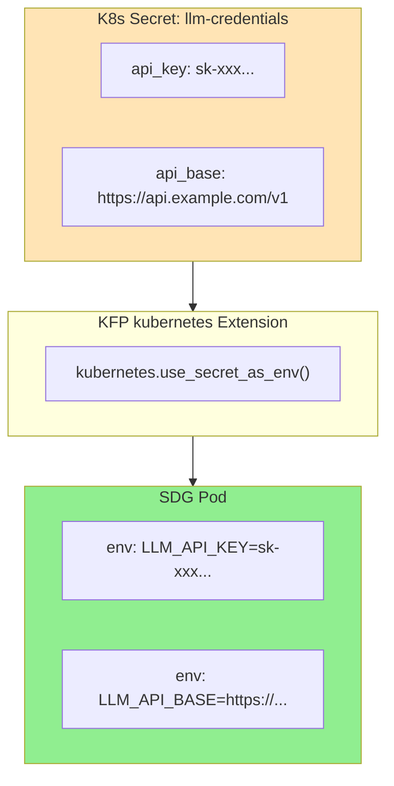

**Why K8s Secrets over other options:**

| Alternative | Why Not Selected |
|-------------|------------------|
| **Inline parameters** | Credentials visible in pipeline definition and logs |
| **ConfigMap** | Not designed for sensitive data; no encryption at rest |
| **External vault** | Adds complexity; K8s Secrets sufficient for most cases |

### 7.4 Secret Structure

The secret uses **dedicated key names** (`api_key`, `api_base`) rather than LiteLLM environment variable names. The component maps these to the appropriate LiteLLM environment variables.

```yaml
# K8s Secret definition
apiVersion: v1
kind: Secret
metadata:
  name: llm-credentials
  namespace: ml-pipelines
type: Opaque
stringData:
  api_key: "sk-xxxxxxxxxxxxxxxxxxxx"
  api_base: "https://api.example.com/v1"
```

**Why dedicated keys (not LiteLLM env var names like `OPENAI_API_KEY`):**

| Alternative | Why Not Selected |
|-------------|------------------|
| **LiteLLM env var names** | Provider-specific; breaks if user changes model |
| **Provider-prefixed keys** | Complex; requires multiple keys per provider |

**Selected: Generic keys** that the component maps to the correct env vars based on the model provider.

### 7.5 Secret Mounting in Pipelines

The component leverages KFP's native Kubernetes extension for secret mounting.

```python
from kfp import dsl
from kfp import kubernetes

@dsl.pipeline
def training_pipeline():
    sdg_task = sdg(
        input_pvc_path="/mnt/data/input.jsonl",
        flow_id="extractive-summary-qa",
        model="hosted_vllm/meta-llama/Llama-3.3-70B-Instruct",
        model_secret_name="llm-credentials",
    )

    # Mount secret as environment variables
    kubernetes.use_secret_as_env(
        sdg_task,
        secret_name="llm-credentials",
        secret_key_to_env={
            "api_key": "LLM_API_KEY",
            "api_base": "LLM_API_BASE",
        },
    )
```

**Internal component logic:**

```python
# Inside component implementation
import os

api_key = os.environ.get("LLM_API_KEY")
api_base = os.environ.get("LLM_API_BASE")

# Configure LiteLLM with these credentials
# (maps to appropriate provider-specific env vars internally)
```

### 7.6 Multiple Model Support

The component supports **only a single model configuration** per execution.

**Reason:** The SDK currently configures one LLM client globally for all blocks. Per-block model overrides are not supported in the SDK's `runtime_params`.

**Workaround for multi-model workflows:**

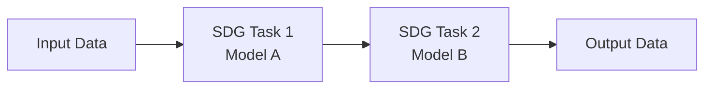

Use separate SDG component instances in sequence, each with its own model configuration.

### 7.7 Component Interface (Model Parameters)

```python
@component
def sdg(
    # ... other params ...

    # ==================== MODEL CONFIGURATION ====================
    model: str = None,
    # LiteLLM format: "provider/model-name"
    # Example: "hosted_vllm/meta-llama/Llama-3.3-70B-Instruct"

    model_secret_name: str = None,
    # K8s Secret name containing api_key and api_base
    # Mounted via kubernetes.use_secret_as_env()
):
```

### 7.8 Usage Examples

#### Example 1: vLLM Endpoint

```yaml
# Secret
apiVersion: v1
kind: Secret
metadata:
  name: vllm-credentials
stringData:
  api_key: "token-abc123"
  api_base: "https://vllm.internal.company.com/v1"
```

```python
@dsl.pipeline
def pipeline():
    sdg_task = sdg(
        input_pvc_path="/mnt/data/input.jsonl",
        flow_id="extractive-summary-qa",
        model="hosted_vllm/meta-llama/Llama-3.3-70B-Instruct",
        model_secret_name="vllm-credentials",
    )

    kubernetes.use_secret_as_env(
        sdg_task,
        secret_name="vllm-credentials",
        secret_key_to_env={
            "api_key": "LLM_API_KEY",
            "api_base": "LLM_API_BASE",
        },
    )
```

#### Example 2: OpenAI API

```yaml
# Secret
apiVersion: v1
kind: Secret
metadata:
  name: openai-credentials
stringData:
  api_key: "sk-xxxxxxxxxxxxxxxxxxxx"
  api_base: "https://api.openai.com/v1"
```

```python
@dsl.pipeline
def pipeline():
    sdg_task = sdg(
        input_pvc_path="/mnt/data/input.jsonl",
        flow_id="extractive-summary-qa",
        model="openai/gpt-4",
        model_secret_name="openai-credentials",
    )

    kubernetes.use_secret_as_env(
        sdg_task,
        secret_name="openai-credentials",
        secret_key_to_env={
            "api_key": "LLM_API_KEY",
            "api_base": "LLM_API_BASE",
        },
    )
```

---

## 8. Execution Configuration

### 8.1 Decision Summary

| Aspect | Decision |
|--------|----------|
| **Concurrency Default** | `max_concurrency=10` (conservative) |
| **Checkpoint Frequency** | `save_freq=100` samples |
| **Log Level** | Component parameter (`log_level`) |
| **Resource Limits** | Use KFP native methods (no component params) |
| **Timeout** | Use KFP native methods (no component params) |

### 8.2 Concurrency Control

The `max_concurrency` parameter limits parallel LLM requests to avoid rate limiting.

```python
max_concurrency: int = 10  # Conservative default
```

**Why 10 as default:**
- Safe for most LLM providers without hitting rate limits
- Users can increase for high-throughput endpoints (e.g., self-hosted vLLM)
- Users can decrease for providers with strict rate limits

### 8.3 Checkpointing Configuration

Checkpointing saves progress to PVC, enabling resume after interruption.

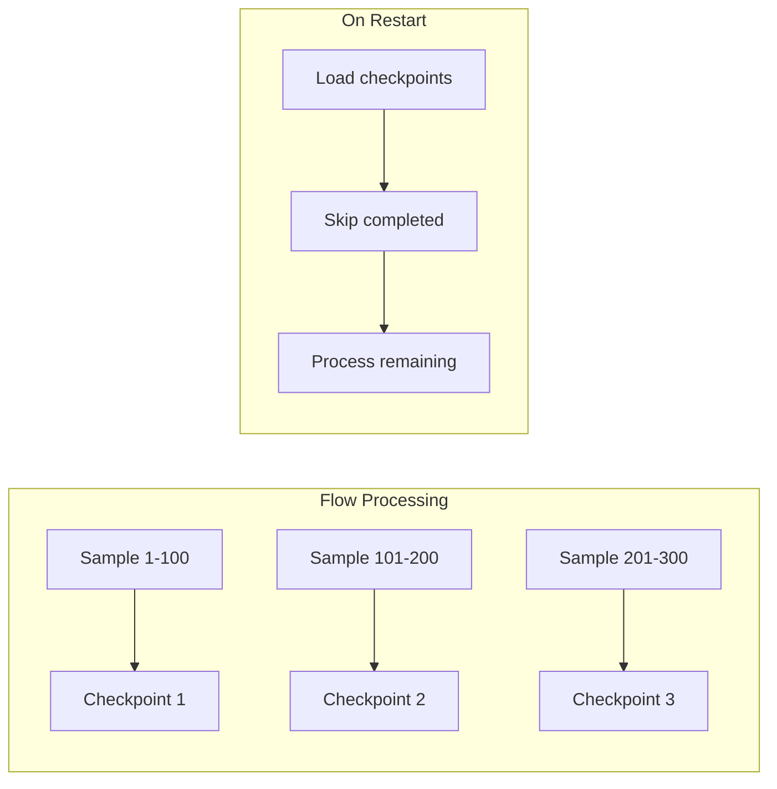

**Parameters:**

| Parameter | Type | Default | Description |
|-----------|------|---------|-------------|
| `checkpoint_pvc_path` | str | None | PVC path for checkpoints; None disables checkpointing |
| `save_freq` | int | 100 | Save checkpoint every N completed samples |

**Why `save_freq=100`:**
- Balances data loss risk (max 99 samples) with I/O overhead
- Reasonable for most dataset sizes
- Users can adjust based on sample processing time

**Checkpoint behavior:**
1. If `checkpoint_pvc_path` is None: No checkpointing (simpler, faster)
2. If path provided: Checkpoints saved every `save_freq` samples
3. On start: Automatically loads existing checkpoints and resumes

### 8.4 Logging Configuration

Log level is controlled via a component parameter for easy pipeline configuration.

```python
log_level: str = "INFO"  # DEBUG, INFO, WARNING, ERROR
```

**Why component parameter (not env var only):**
- Visible in KFP UI and pipeline definition
- Easy to adjust per pipeline run
- More discoverable than environment variables

**Log output:**
- Logs go to stdout/stderr (K8s native)
- KFP captures and displays in task logs
- No separate log aggregation required

### 8.5 Resource Configuration

Resource requests and limits are configured using **KFP's native methods**, not component parameters.

```python
@dsl.pipeline
def pipeline():
    sdg_task = sdg(
        input_pvc_path="/mnt/data/input.jsonl",
        flow_id="extractive-summary-qa",
    )

    # Configure resources via KFP native methods
    sdg_task.set_cpu_request("2")
    sdg_task.set_cpu_limit("4")
    sdg_task.set_memory_request("8Gi")
    sdg_task.set_memory_limit("16Gi")
```

**Why KFP native (not component params):**

| Alternative | Why Not Selected |
|-------------|------------------|
| **Component parameters** | Duplicates KFP functionality; inconsistent with other components |
| **Hardcoded defaults** | Inflexible; different flows have different requirements |

**Selected: KFP native** because it's consistent with KFP patterns and avoids duplication.

### 8.6 Timeout Configuration

Execution timeout is configured using **KFP's native method**.

```python
@dsl.pipeline
def pipeline():
    sdg_task = sdg(...)

    # Set timeout via KFP native method (seconds)
    sdg_task.set_timeout(7200)  # 2 hours
```

**Why KFP native:** Same rationale as resource configuration - avoids duplication, consistent with KFP patterns.

### 8.7 Component Interface (Execution Parameters)

```python
@component
def sdg(
    # ... other params ...

    # ==================== EXECUTION ====================
    max_concurrency: int = 10,
    # Maximum concurrent LLM requests (default: 10)

    checkpoint_pvc_path: str = None,
    # PVC path for checkpoints; None disables checkpointing

    save_freq: int = 100,
    # Checkpoint save frequency in samples

    log_level: str = "INFO",
    # Logging level: DEBUG, INFO, WARNING, ERROR
):
```

### 8.8 Usage Examples

#### Example 1: Default Execution Settings

```python
sdg_task = sdg(
    input_pvc_path="/mnt/data/input.jsonl",
    flow_id="extractive-summary-qa",
    model="hosted_vllm/meta-llama/Llama-3.3-70B-Instruct",
    # Uses defaults: max_concurrency=10, no checkpointing, log_level=INFO
)
```

#### Example 2: High-Throughput with Checkpointing

```python
@dsl.pipeline
def high_throughput_pipeline():
    sdg_task = sdg(
        input_pvc_path="/mnt/data/large_dataset.jsonl",
        flow_id="extractive-summary-qa",
        model="hosted_vllm/meta-llama/Llama-3.3-70B-Instruct",

        # High concurrency for self-hosted vLLM
        max_concurrency=50,

        # Enable checkpointing for large job
        checkpoint_pvc_path="/mnt/checkpoints/job-001/",
        save_freq=200,  # Less frequent saves for speed

        log_level="DEBUG",  # Verbose logging for monitoring
    )

    # Allocate resources for high throughput
    sdg_task.set_cpu_request("4")
    sdg_task.set_memory_request("16Gi")
    sdg_task.set_timeout(14400)  # 4 hours

    # Mount checkpoint PVC
    kubernetes.mount_pvc(
        sdg_task,
        pvc_name="sdg-checkpoints",
        mount_path="/mnt/checkpoints",
    )
```

#### Example 3: Conservative Settings for Rate-Limited API

```python
sdg_task = sdg(
    input_pvc_path="/mnt/data/input.jsonl",
    flow_id="extractive-summary-qa",
    model="openai/gpt-4",

    # Low concurrency to avoid rate limits
    max_concurrency=5,

    # Frequent checkpoints (expensive API calls)
    checkpoint_pvc_path="/mnt/checkpoints/",
    save_freq=50,
)
```

---

## 9. Error Handling & Observability

### 9.1 Decision Summary

| Aspect | Decision |
|--------|----------|
| **Failure Behavior** | Fail-fast on unrecoverable errors |
| **Retry Logic** | Use SDK defaults (tenacity-based) |
| **Metrics Scope** | Extended metrics including per-block timing |
| **Log Format** | Human-readable (standard Python logging) |
| **Progress Reporting** | Periodic log messages |

### 9.2 Failure Behavior

The component uses **fail-fast** semantics: stop on first unrecoverable error and save checkpoint if enabled.

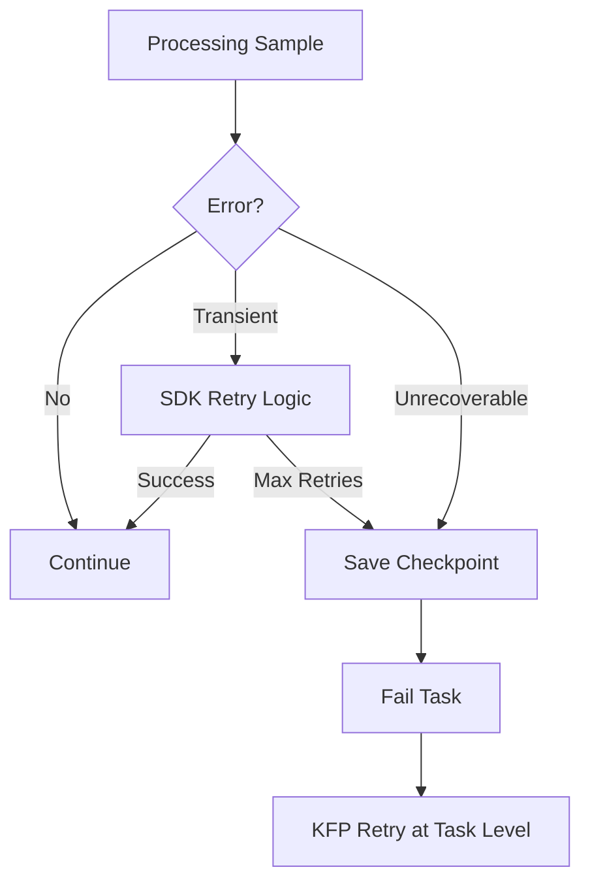

**Why fail-fast:**
- Simple and predictable behavior
- Checkpoints preserve progress before failure
- KFP handles task-level retries natively
- Avoids silently producing incomplete data

**Rejected alternative:**

| Alternative | Why Not Selected |
|-------------|------------------|
| **Best-effort (skip failures)** | May produce incomplete data silently; harder to debug |

### 9.3 Retry Logic

The component **uses SDK defaults** for retry behavior. The SDK uses `tenacity` for transient error handling (rate limits, timeouts).

**Why not expose retry params:**
- SDK defaults are well-tuned for common providers
- Reduces component surface area
- Users rarely need to customize retry behavior

### 9.4 KFP Metrics

The component produces extended metrics via `Output[Metrics]`, visible in KFP UI.

#### Metrics Reference

| Metric | Type | Description |
|--------|------|-------------|
| **Core Metrics** | | |
| `input_rows` | int | Total input samples |
| `output_rows` | int | Total output samples |
| `execution_time_seconds` | float | Total wall-clock time |
| **Checkpoint Metrics** | | |
| `checkpoints_saved` | int | Number of checkpoint files written |
| `samples_from_checkpoint` | int | Samples loaded from previous run |
| `samples_newly_processed` | int | Samples processed in this run |
| **Flow Metrics** | | |
| `blocks_total` | int | Total blocks in flow |
| `blocks_succeeded` | int | Blocks that completed successfully |
| **LLM Metrics** *(if SDK exposes)* | | |
| `llm_requests_total` | int | Total LLM API calls made |
| `llm_requests_retried` | int | Requests that required retry |
| `tokens_prompt_total` | int | Total prompt tokens used |
| `tokens_completion_total` | int | Total completion tokens used |
| **Per-Block Timing** | | |
| `block_{name}_duration_seconds` | float | Execution time per block |

**Note:** LLM token metrics depend on SDK exposing this data. If not available, they will be omitted.

#### Metrics Usage Example

```python
# Inside component implementation
from kfp.dsl import Metrics

def log_metrics(metrics: Metrics, stats: dict):
    # Core metrics
    metrics.log_metric("input_rows", stats["input_rows"])
    metrics.log_metric("output_rows", stats["output_rows"])
    metrics.log_metric("execution_time_seconds", stats["duration"])

    # Checkpoint metrics
    metrics.log_metric("checkpoints_saved", stats["checkpoints_saved"])
    metrics.log_metric("samples_from_checkpoint", stats["resumed_samples"])
    metrics.log_metric("samples_newly_processed", stats["new_samples"])

    # Flow metrics
    metrics.log_metric("blocks_total", stats["blocks_total"])
    metrics.log_metric("blocks_succeeded", stats["blocks_succeeded"])

    # Per-block timing
    for block_name, duration in stats["block_timings"].items():
        metrics.log_metric(f"block_{block_name}_duration_seconds", duration)

    # LLM metrics (if available)
    if "tokens_prompt" in stats:
        metrics.log_metric("tokens_prompt_total", stats["tokens_prompt"])
        metrics.log_metric("tokens_completion_total", stats["tokens_completion"])
```

### 9.5 Logging Configuration

The component uses **human-readable** log format for easy viewing in KFP UI.

```
# Log output example
2025-01-21 14:30:52 INFO  [sdg] Starting flow: extractive-summary-qa
2025-01-21 14:30:52 INFO  [sdg] Input: 1000 samples
2025-01-21 14:30:52 INFO  [sdg] Loaded 500 samples from checkpoint
2025-01-21 14:31:15 INFO  [sdg] Progress: 100/500 samples (20%)
2025-01-21 14:31:38 INFO  [sdg] Progress: 200/500 samples (40%)
2025-01-21 14:32:01 INFO  [sdg] Progress: 300/500 samples (60%)
2025-01-21 14:32:24 INFO  [sdg] Progress: 400/500 samples (80%)
2025-01-21 14:32:47 INFO  [sdg] Progress: 500/500 samples (100%)
2025-01-21 14:32:48 INFO  [sdg] Flow completed: 1000 output samples
2025-01-21 14:32:48 INFO  [sdg] Execution time: 116.2 seconds
```

**Why human-readable (not JSON):**
- Easier to read in KFP task logs UI
- Standard Python logging is familiar
- JSON structured logs add complexity with minimal benefit for this use case

### 9.6 Progress Reporting

The component logs progress **periodically** during execution.

**Progress log frequency:**
- Log every `save_freq` samples (aligned with checkpointing)
- Always log start and completion
- Log errors with context

```python
# Progress logging implementation
def log_progress(current: int, total: int, start_time: float):
    elapsed = time.time() - start_time
    percent = (current / total) * 100
    rate = current / elapsed if elapsed > 0 else 0
    eta = (total - current) / rate if rate > 0 else 0

    logger.info(
        f"Progress: {current}/{total} samples ({percent:.0f}%) "
        f"[{rate:.1f} samples/sec, ETA: {eta:.0f}s]"
    )
```

**Example output:**
```
Progress: 100/1000 samples (10%) [8.3 samples/sec, ETA: 108s]
Progress: 200/1000 samples (20%) [8.5 samples/sec, ETA: 94s]
```

### 9.7 Error Messages

When failures occur, the component provides actionable error messages:

```
# Error message examples
ERROR [sdg] LLM API error: Rate limit exceeded (429).
      Retried 3 times, giving up. Checkpoint saved at /mnt/checkpoints/checkpoint_0005.jsonl
      Resume by re-running with same checkpoint_pvc_path.

ERROR [sdg] Flow validation failed: Required column 'document' not found in input dataset.
      Available columns: ['text', 'metadata', 'id']

ERROR [sdg] Block 'generate_qa' failed: Invalid JSON in LLM response.
      Sample ID: 42, Checkpoint saved with 400 completed samples.
```

---

## 10. Container & Packaging

### 10.1 Decision Summary

| Aspect | Decision |
|--------|----------|
| **Base Image** | UBI 9 Python 3.11 (`ubi9/python-311`) |
| **Dependencies** | Pre-baked in image (no runtime install) |
| **Versioning** | Match SDK semantic versioning |
| **Distribution** | Python package + auto-generated YAML |
| **Registry** | Mirror to Quay.io and GHCR |

### 10.2 Base Image

The component uses Red Hat Universal Base Image (UBI) for enterprise compatibility.

```dockerfile
FROM registry.access.redhat.com/ubi9/python-311:latest

# Install SDG Hub with all dependencies
COPY . /src
RUN pip install --no-cache-dir /src

# Set entrypoint for KFP
ENTRYPOINT ["python", "-m", "sdg_hub.kfp"]
```

**Why UBI:**

| Alternative | Why Not Selected |
|-------------|------------------|
| **Python slim** | No enterprise support, security scanning, or FIPS compliance |
| **Custom base** | Extra maintenance; UBI provides what we need |

**Selected: UBI 9** for:
- Enterprise certification (OpenShift/RHOAI alignment)
- Security scanning and CVE patching
- FIPS compliance capability
- Red Hat support

### 10.3 Dependency Management

All dependencies are **pre-baked** into the container image at build time.

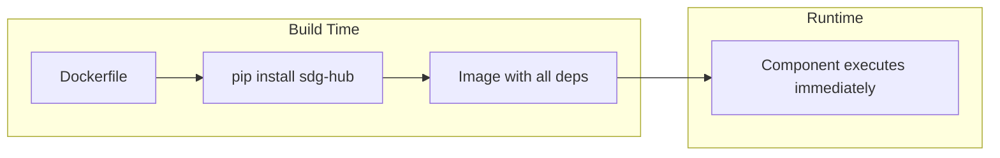

**Why pre-baked (not runtime install):**

| Alternative | Why Not Selected |
|-------------|------------------|
| **`packages_to_install`** | 30-60s pip install overhead per run; network dependency; version resolution risk |

**Benefits of pre-baked:**
- Fast startup (no download/install step)
- No network dependency at runtime
- Exact version reproducibility
- Reliable in air-gapped environments

### 10.4 Image Versioning

Container images follow the **same semantic versioning as the SDK**.

```
quay.io/redhat-ai-innovation/sdg-hub-kfp:v1.0.0
quay.io/redhat-ai-innovation/sdg-hub-kfp:v1.0.1
quay.io/redhat-ai-innovation/sdg-hub-kfp:v1.1.0
```

**Tag strategy:**

| Tag | Purpose |
|-----|---------|
| `v1.0.0` | Immutable release version |
| `v1.0` | Points to latest patch in minor version |
| `v1` | Points to latest minor in major version |
| `latest` | Points to most recent release |
| `sha-abc1234` | Git SHA for exact build traceability |

**Why match SDK versioning:**
- Clear compatibility: component `v1.2.0` uses SDK `v1.2.0`
- Single version number to communicate
- Aligned release process

### 10.5 Component Distribution

The component is distributed via **Python package** with **auto-generated YAML** for flexibility.

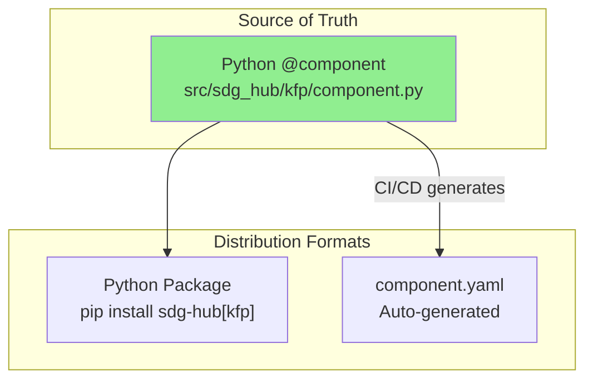

#### Python Package (Primary)

Users install the package and import the component:

```python
# Install
pip install sdg-hub[kfp]

# Use in pipeline
from sdg_hub.kfp import sdg

@dsl.pipeline
def my_pipeline():
    sdg_task = sdg(
        input_pvc_path="/data/input.jsonl",
        flow_id="extractive-summary-qa",
    )
```

**Benefits:**
- IDE autocomplete and type hints
- Docstring documentation
- Version managed via pip
- Modern KFP v2 native pattern

#### Component YAML (Auto-Generated)

YAML is automatically generated from the Python definition—no dual maintenance.

```python
# scripts/generate_component_yaml.py
from kfp import compiler
from sdg_hub.kfp import sdg

compiler.Compiler().compile(
    pipeline_func=sdg,
    package_path="component.yaml"
)
```

Users can load from YAML without installing the package:

```python
from kfp.components import load_component_from_url

sdg = load_component_from_url(
    "https://github.com/Red-Hat-AI-Innovation-Team/sdg_hub/releases/download/v1.0.0/component.yaml"
)

@dsl.pipeline
def my_pipeline():
    sdg_task = sdg(input_pvc_path="/data/input.jsonl", ...)
```

**CI/CD Integration:**

```yaml
# .github/workflows/release.yaml
- name: Generate component YAML
  run: python scripts/generate_component_yaml.py

- name: Publish as release asset
  uses: actions/upload-release-asset@v1
  with:
    asset_path: component.yaml
    asset_name: component.yaml
```

### 10.6 Container Registry

Images are mirrored to **both** Quay.io and GitHub Container Registry.

| Registry | Image |
|----------|-------|
| **Quay.io** (primary) | `quay.io/redhat-ai-innovation/sdg-hub-kfp:v1.0.0` |
| **GHCR** (mirror) | `ghcr.io/red-hat-ai-innovation-team/sdg-hub-kfp:v1.0.0` |

**Why both:**
- Quay.io: Red Hat ecosystem alignment, enterprise features
- GHCR: GitHub integration, backup availability
- Redundancy: if one registry has issues, users can pull from the other

### 10.7 Dockerfile Structure

```dockerfile
# Dockerfile.kfp
FROM registry.access.redhat.com/ubi9/python-311:latest

LABEL maintainer="Red Hat AI Innovation Team"
LABEL version="${VERSION}"

# Install system dependencies (if any)
USER root
RUN dnf install -y --nodocs \
    && dnf clean all

# Install Python dependencies
USER 1001
WORKDIR /app

# Copy and install sdg-hub
COPY --chown=1001:0 . /app
RUN pip install --no-cache-dir ".[kfp]"

# Verify installation
RUN python -c "from sdg_hub.kfp import sdg; print('Component loaded successfully')"

# Default entrypoint (overridden by KFP)
ENTRYPOINT ["python"]
```

### 10.8 Build & Release Process

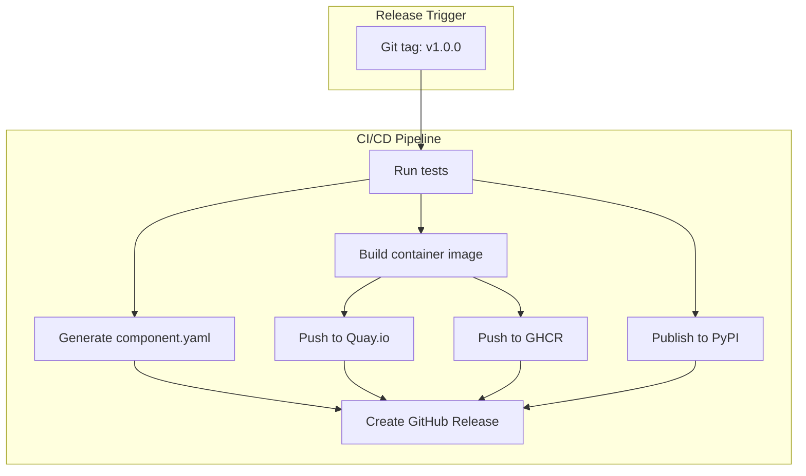

**Release artifacts:**
- Container image on Quay.io and GHCR
- Python package on PyPI
- `component.yaml` as GitHub Release asset
- Release notes

---

## Appendix A: Complete Component Interface (Draft)

```python
from kfp.dsl import component, Input, Output, Dataset, Metrics

@component(
    base_image="quay.io/redhat-ai-innovation/sdg-hub:latest",
)
def sdg(
    # ==================== INPUT OPTIONS ====================
    input_artifact: Input[Dataset] = None,
    input_pvc_path: str = None,
    hf_dataset_config: dict = None,

    # ==================== OUTPUT ====================
    output_artifact: Output[Dataset],
    output_metrics: Output[Metrics],
    export_to_pvc: bool = False,
    export_path: str = None,

    # ==================== FLOW SELECTION ====================
    flow_id: str = None,
    flow_yaml_path: str = None,

    # ==================== MODEL CONFIGURATION ====================
    model: str = None,
    model_secret_name: str = None,

    # ==================== EXECUTION ====================
    max_concurrency: int = 10,
    checkpoint_pvc_path: str = None,
    save_freq: int = 100,
    log_level: str = "INFO",

    # ==================== COMPONENT-LEVEL LLM PARAMETERS ====================
    # Applied globally to all LLM blocks; overridable by runtime_params
    temperature: float = None,
    max_tokens: int = None,
    top_p: float = None,
    n: int = None,
    presence_penalty: float = None,
    frequency_penalty: float = None,

    # ==================== BLOCK-LEVEL OVERRIDES ====================
    runtime_params: dict = None,
):
    """
    SDG Hub data generation component for Kubeflow Pipelines.

    Runs a synthetic data generation flow on input data, producing
    enriched output suitable for model training.

    Args:
        input_artifact: KFP Dataset artifact from upstream component
        input_pvc_path: Path to JSONL file on mounted PVC
        hf_dataset_config: HuggingFace dataset configuration dict
        output_artifact: KFP Dataset artifact for downstream components
        output_metrics: KFP Metrics artifact with execution stats
        export_to_pvc: Whether to also write output to PVC
        export_path: Base path for PVC export
        flow_id: Built-in flow ID from SDG Hub registry
        flow_yaml_path: Path to custom flow YAML (mounted from ConfigMap)
        model: LiteLLM model identifier
        model_secret_name: K8s Secret containing api_key and api_base
        max_concurrency: Maximum concurrent LLM requests
        checkpoint_pvc_path: PVC path for checkpoints (enables resume)
        save_freq: Checkpoint save frequency (samples)
        temperature: LLM temperature (0.0-2.0)
        max_tokens: Maximum response tokens
        top_p: Nucleus sampling threshold (0.0-1.0)
        n: Number of completions per input
        presence_penalty: Presence penalty (-2.0 to 2.0)
        frequency_penalty: Frequency penalty (-2.0 to 2.0)
        runtime_params: Block-specific parameter overrides
    """
    pass
```

---

## Appendix B: Glossary

| Term | Definition |
|------|------------|
| **Block** | Atomic data transformation unit in SDG Hub |
| **Flow** | YAML-defined pipeline of blocks |
| **KFP** | Kubeflow Pipelines |
| **Artifact** | Data object passed between KFP components |
| **PVC** | Persistent Volume Claim (K8s storage) |
| **LiteLLM** | Library supporting 100+ LLM providers with unified API |

---

## Revision History

| Version | Date | Author | Changes |
|---------|------|--------|---------|
| 0.1 | 2025-01-16 | SDG Hub Team | Initial draft with Phases 1-6 |
| 0.2 | 2025-01-16 | SDG Hub Team | Added Phase 7: Model/LLM Configuration |
| 0.3 | 2025-01-21 | SDG Hub Team | Added Phase 8: Execution Configuration |
| 0.4 | 2025-01-21 | SDG Hub Team | Added Phase 9: Error Handling & Observability |
| 0.5 | 2025-01-21 | SDG Hub Team | Added Phase 10: Container & Packaging |
